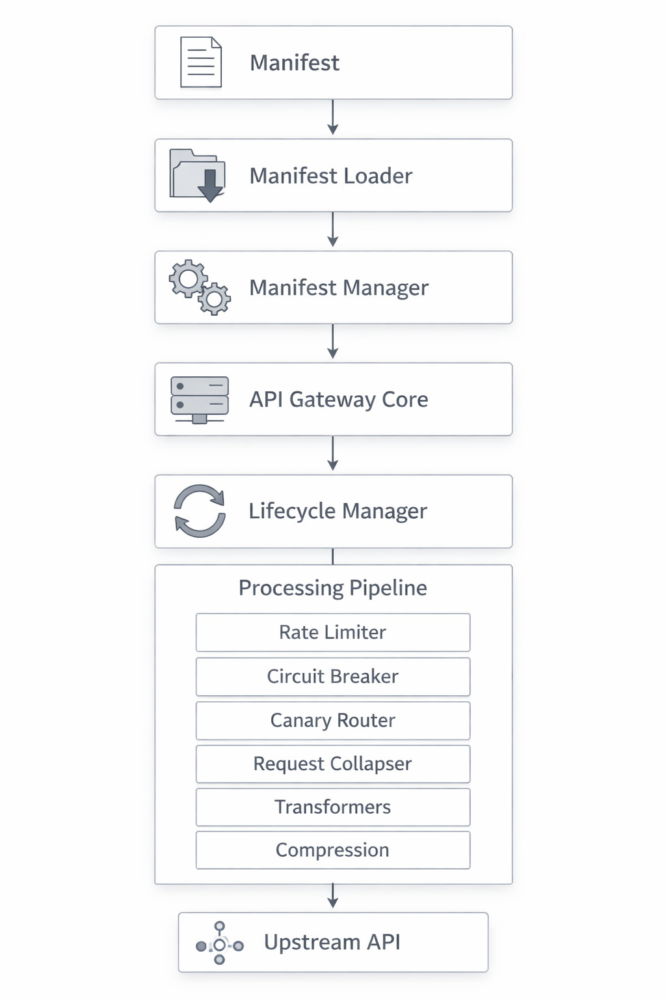
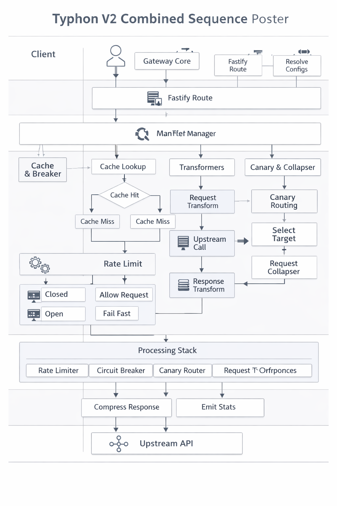

# Typhoon — Full Documentation

Typhoon is a manifest‑driven API gateway built on Fastify, designed for:

- High‑performance request proxying  
- Canary routing  
- Request collapsing  
- Circuit breaking  
- Rate limiting  
- Caching  
- Transformations  
- Compression  
- Observability  

It is fully modular, strongly typed, and designed for edge deployments (Raspberry Pi, Docker, ARM64).

---

1. Architecture Overview

Typhoon is composed of:

- Manifest Loader  
  Loads and merges global → service → route configuration.

- Manifest Manager  
  Produces final ServiceConfig[] used by the gateway.

- Gateway Core Plugin  
  Registers routes, proxies upstream, applies all features.

- Lifecycle Manager  
  Handles caching, transformers, stats, compression.

- Cache System  
  Pluggable stores: memory, redis, memcached, noop.

- Circuit Breaker  
  Per‑service breaker with failure thresholds.

- Rate Limiter  
  Per‑route or per‑service limits.

- Request Collapser  
  Deduplicates concurrent identical upstream calls.

- Transformers  
  Declarative request/response mutation pipeline.

- Compression Negotiator  
  br / gzip / deflate / identity.

- Stats Plugin  
  Emits structured logs for requests.



---

2. Manifest Specification

2.1 Manifest

```ts
interface Manifest {
  global?: GlobalConfig
  services: ServiceConfig[]
}
```

---

2.2 GlobalConfig

```ts
interface GlobalConfig {
  cors?: CorsConfig
  cache?: CacheConfig
  breaker?: BreakerConfig
  rateLimit?: RateLimitConfig
  transformers?: TransformerConfig
}
```

---

2.3 ServiceConfig

```ts
interface ServiceConfig {
  name: string
  prefix: string
  target: string

  canary?: {
    version: string
    weight?: number
    target?: string
  }

  cors?: CorsConfig
  cache?: CacheConfig
  breaker?: BreakerConfig
  rateLimit?: RateLimitConfig
  transformers?: TransformerConfig

  upstreamTimeoutMs?: number
  routes?: RouteConfig[]
}
```

---

2.4 RouteConfig

```ts
interface RouteConfig {
  path: string
  methods?: ("GET" | "POST" | "PUT" | "PATCH" | "DELETE")[]
  cors?: CorsConfig
  cache?: CacheConfig
  breaker?: BreakerConfig
  rateLimit?: RateLimitConfig
  transformers?: TransformerConfig
  canary?: {
    version: string
    weight?: number
    target?: string
  }
}
```

---

2.5 TransformerConfig

```ts
interface TransformerConfig {
  onRequest?: TransformerDefinition[]
  onResponse?: TransformerDefinition[]
}
```

---

3. Manifest Loading

3.1 File Loader

```ts
class FileManifestLoader {
  constructor(filePath: string)
  load(): Promise<Manifest>
}
```

3.2 Remote Loader

```ts
class RemoteManifestLoader {
  constructor(url: string, headers?: Record<string, string>)
  load(): Promise<Manifest>
}
```

3.3 Loader Factory

```ts
class ManifestLoaderFactory {
  static create(type: "file" | "remote", options: any)
}
```

3.4 Manifest Manager

```ts
class ManifestManager {
  constructor(manifest: Manifest)
  loadServices(): ServiceConfig[]
}
```

Merges:

```
global → service → route
```

---

4. Cache System

4.1 CacheConfig

```ts
interface CacheConfig {
  enabled: boolean
  ttlSeconds: number
  store?: "memory" | "redis" | "memcached" | "none"
  redisUrl?: string
}
```

---

4.2 ICacheStore

```ts
interface ICacheStore {
  get(key: string): Promise<string | null>
  set(key: string, value: string, ttlSeconds: number): Promise<void>
  del(key: string): Promise<void>
}
```

---

4.3 Stores

- MemoryCacheStore
- RedisCacheStore
- MemcachedStore
- NoopCacheStore

---

4.4 CacheManager

```ts
class CacheManager {
  static createStore(cfg?: CacheConfig): ICacheStore
}
```

---

4.5 Cache Plugin

Decorates Fastify:

```ts
fastify.cacheStore: ICacheStore
```

---

5. Circuit Breaker

```ts
class CircuitBreakerRegistry {
  static get(name: string, config: BreakerConfig): {
    allowRequest(): boolean
    recordSuccess(): void
    recordFailure(): void
  }
}
```

---

6. Rate Limiting

```ts
class RateLimitFactory {
  static create(config: RateLimitConfig):
    | {
        hit(key: string, limit: number): {
          allowed: boolean
          limit: number
          remaining: number
          reset: number
        }
      }
    | null
}
```

---

7. Request Collapsing

```ts
class RequestCollapser {
  static run<T>(key: string, fn: () => Promise<T>): Promise<T>
}
```

---

8. Canary Routing

```ts
function selectTarget(input: {
  target: string
  canary?: { target?: string; weight?: number }
}): string
```

---

9. Transformers

9.1 Definition

```ts
interface TransformerDefinition {
  name: string
  options?: Record<string, any>
}
```

---

9.2 Runner

```ts
function runRequestTransformers(config: TransformerConfig, ctx: TransformerContext)
function runResponseTransformers(config: TransformerConfig, ctx: TransformerContext)
```

---

10. Compression

10.1 CompressionNegotiator

```ts
class CompressionNegotiator {
  static negotiate(request: FastifyRequest): "br" | "gzip" | "deflate" | "identity"

  static compress(
    payload: any,
    request: FastifyRequest,
    reply: FastifyReply
  ): Promise<Buffer | string>
}
```

---

11. Lifecycle Manager

```ts
class LifecycleManager {
  constructor(
    service: ServiceConfig,
    route: RouteConfig,
    req: FastifyRequest,
    reply: FastifyReply
  )

  tryCacheGet(): Promise<any | undefined>
  runRequestTransformers(): Promise<void>
  runResponseTransformers(): Promise<void>
  tryCacheSet(body: any): Promise<void>

  buildStatsPayload(latencyMs: number): StatsPayload
}
```

---

12. Stats System

12.1 StatsPayload

```ts
interface StatsPayload {
  apiId: string
  correlationId?: string
  statusCode: number
  version: string
  eventType: "request"
  method: string
  path: string
  clientIp: string
  latencyMs: number
}
```

---

12.2 Stats Plugin

- Hooks onResponse
- Reads req.routeOptions.config.route
- Checks for transformer "stats-console"
- Logs structured JSON

---

13. Gateway Core

The heart of Typhoon v2.

13.1 Responsibilities

- Register routes  
- Rate limit  
- Circuit break  
- Canary routing  
- Request collapsing  
- Upstream proxy  
- Transformers  
- Compression  
- Stats  

---

13.2 Route Registration

```ts
fastify.route({
  method,
  url,
  config: { service, route },
  handler: handleGatewayRequest
})
```

---

13.3 Upstream Flow

1. Rate limit  
2. Circuit breaker  
3. Select canary target  
4. Request transformers  
5. Collapse identical requests  
6. Axios upstream call  
7. Response transformers  
8. Compression  
9. Proxy response  
10. Stats emission  

---

14. App Bootstrap

```ts
async function buildApp() {
  const fastify = Fastify({ logger: true })

  const manifest = await new ManifestLoader({
    type: "file",
    options: { filePath: "./manifest.json" },
  }).load()

  const manager = new ManifestManager(manifest)
  const services = manager.loadServices()

  fastify.register(cachePlugin, { cache: manifest.global?.cache })
  fastify.register(responseTime)
  fastify.register(statsPlugin)

  for (const service of services) {
    fastify.register(gatewayCore, service)
  }

  return fastify
}
```

---

15. Extension Points

Typhoon is designed for extension:

- Add new transformer types  
- Add new cache stores  
- Add new stats backends  
- Add new breaker strategies  
- Add new rate limiters  
- Add new compression algorithms  
- Add new manifest loaders  

Everything is modular and strongly typed.

---

16. Example Manifest

```json
{
  "global": {
    "cache": { "enabled": true, "ttlSeconds": 60, "store": "memory" },
    "breaker": { "enabled": true, "threshold": 5, "timeoutMs": 30000 },
    "rateLimit": { "enabled": true, "limit": 1000 },
    "transformers": {
      "onResponse": [{ "name": "stats-console" }]
    }
  },
  "services": [
    {
      "name": "catalog-api",
      "prefix": "/products",
      "target": "http://catalog:3000",
      "routes": [
        {
          "path": "/list",
          "methods": ["GET"],
          "cache": { "enabled": true, "ttlSeconds": 30 }
        }
      ]
    }
  ]
}
```



---


